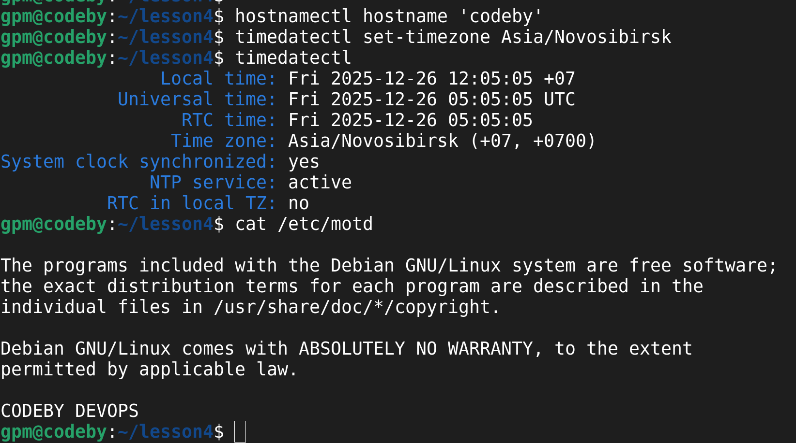
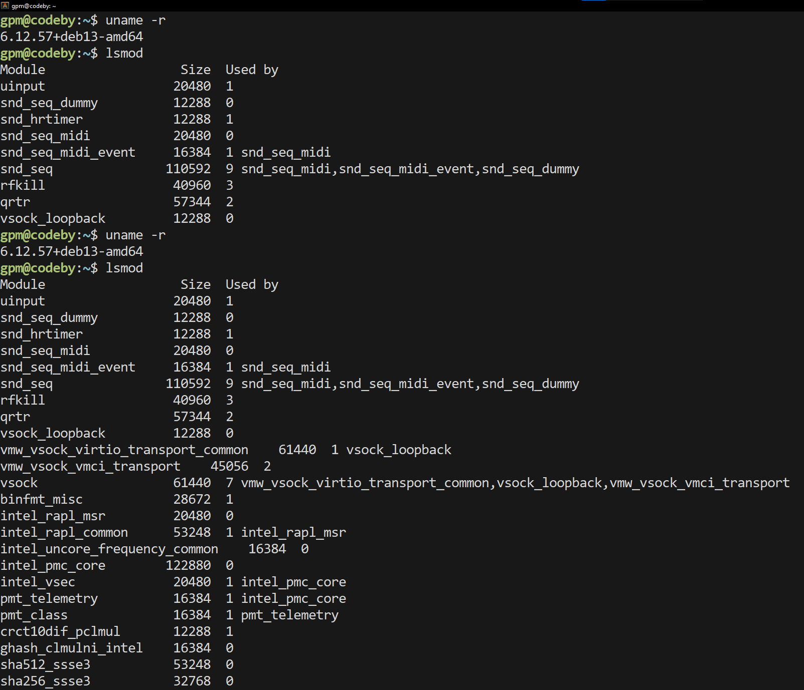
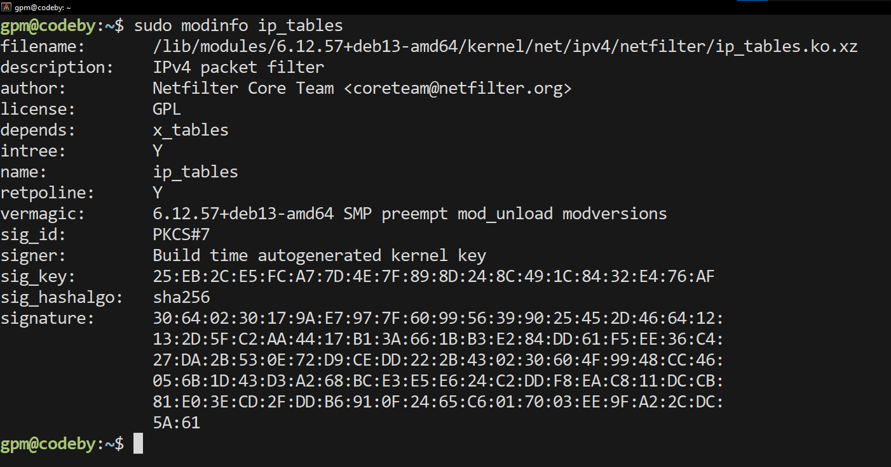
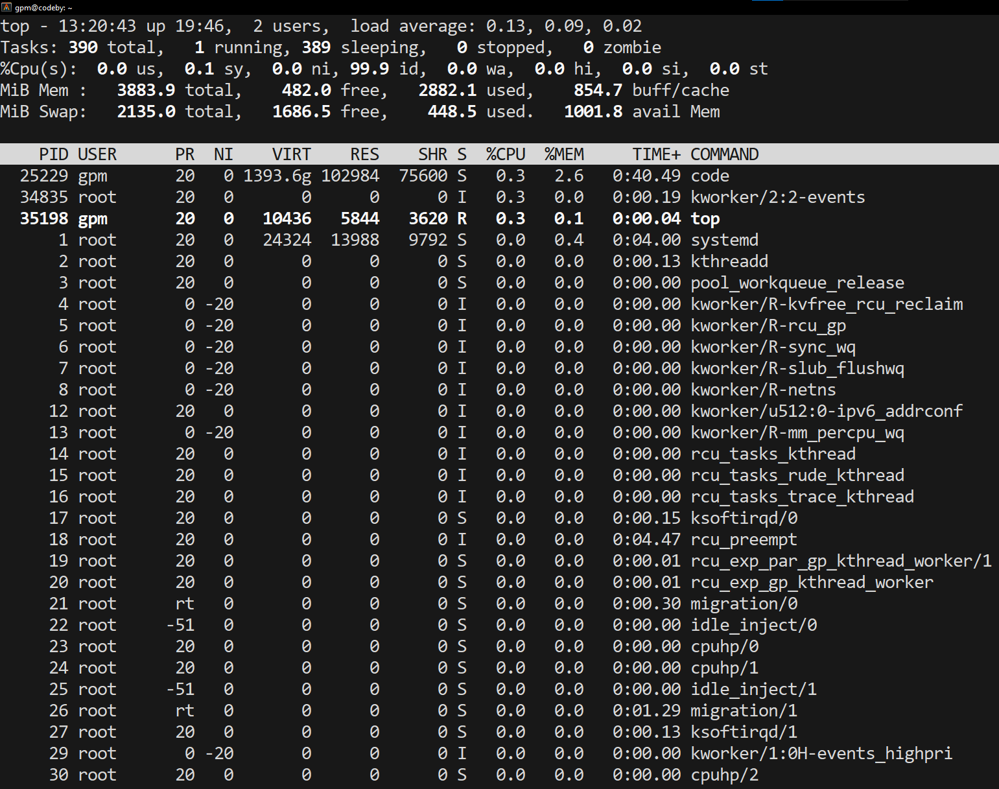
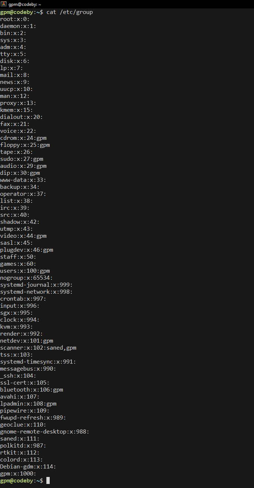

# Изменить конфигурацию ОС

# Добавить в репозиторий скриншоты:

- подключения к ВМ через SSH с напечатанным выводом MOTD

- Системную информацию о:
o версии ядра

o модулях ядра (loaded and active)

o информацию о ресурсах (CPU and Memory)

o информацию о пользователях и группах

